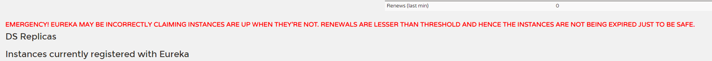
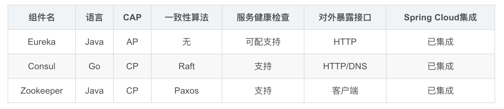

注册中心的作用：
所谓服务注册中心就是在整个的微服务架构中单独提出一个服务，
这个服务不完成系统的任何的业务功能，
**仅仅**用来完成对整个微服务系统的服务注册和服务发现，以及对服务健康状态的监控和管理功能。
-------------------------eureka-----------------------------
服务端需要配置
eureka.client.register-with-eureka=false    #不再将自己同时作为客户端进行注册  
eureka.client.fetch-registry=false				  #关闭作为客户端时从eureka server获取服务信息

客户端配置
eureka.client.service-url.defaultZone=http://localhost:8761/eureka #eureka注册中心地址

新版本需要集成spring-boot-starter-mvc

服务频繁启动时 EurekaServer出现警告

自我保护机制：
服务端默认90秒没有收到客户端的心跳连接，则会移除这个实例，但是当出现网络分区故障的时候，不应该移除这个实例，
所以引入了自我保护机制，自保机制开启后会检查在过去的15分钟内发生故障的实例有没有超过85%，超出这个界限则默认为发生分区故障，保留当前的实例
，以保证当前的节点可用，当网络稳点后，会同步注册信息到其他节点

在服务端关闭自我保护机制
eureka.server.enable-self-preservation=false  #关闭自我保护
eureka.server.eviction-interval-timer-in-ms=3000 #超时3s自动清除

---------------------------consul------------------------------------------------------
consul是由第三方应用作为注册中心，我们使用consul来作为注册中心则不需要开发服务端，下载安装即可

                                      
不同注册中心的区别
1. 注册中心都会遵循cpa定理，指的是在一个分布式系统中，C（一致性），（P）分区容错性,(A)可用性三则只能兼备两个
        
eureka特点
eureka没有任何数据强一致性的算法保证不同集群间的server数据一致性，
仅仅通过数据拷贝的方式争取注册中心数据的最终一致性

consul特点
基于Raft算法，consul提供一致性的注册中心服务，但是由于Leader节点承担了所有的处理工作，势必加大了注册和发现的代价
降低服务的可能性，通过Gossip协议，Consul可以很好的监控Consul集群的运行，同时可以方便通知各类事件，如leader事件，
如leader选择发生，server地址变更等。

zookeeper特点
基于Zab协议，Zookeeper可以用于构建具备数据强一致性的服务注册与发现中心，
而与此相对地牺牲了服务的可用性和提高了注册需要的时间。 

                             

--------------------------------服务之间通信/调用------------------------------------------------------
本demo中的案例以consul为注册中心

####1.restTemplate
spring框架提供的RestTemplate类可用于在应用中调用rest服务，他简化了一下http的通信方式，统一了restful标准
封装了http连接,
使用restTemplate存在硬编码，代码写死不易维护，且服务器宕机不能有效剔除，默认没有负载均衡策略，需要自己实现

####2.Ribbon
consul和eureka默认有实现ribbon 如使用的注册中心无此依赖则添加以下
spring-cloud-starter-netflix-ribbon
  
####ribbon的三种调用方式
- 使用discovery client  进行客户端调用
- 使用loadBalanceClient 进行客户端调用
- 使用@loadBalanced     进行客户端调用

###几种负载均衡策略
1. RoundRobinRule （轮询）
2. RandomRule （随机策略）
3. AvailabilityFilteringRule（可过滤策略）
   会先过滤由于多次访问故障而处于断路器跳闸状态的服务，
   还有并发的连接数量超过阈值的服务，然后对剩余的服务列表按照轮询策略进行调用
4. WeightedResponseTimeRule （响应时间加权策略）
   根据平均响应的时间计算所有服务的权重，响应时间越快服务权重越大被选中的概率越高，
   刚启动时如果统计信息不足，则使用RoundRobinRule策略，等统计信息足够会切换到
5. RetryRule （重试策略）
   先按照RoundRobinRule的策略获取服务，
   如果获取失败则在制定时间内进行重试，获取可用的服务
6. BestAviableRule（最低并发策略）
   会先过滤掉由于多次访问故障而处于断路器跳闸状态的服务，
   然后选择一个并发量最小的服务
   
###修改服务的默认负载均衡策略
//写在调用端
服务id.ribbon.NFLoadBalancerRuleClassName=com.netflix.loadbalancer.RandomRule

//config没配置好
    

